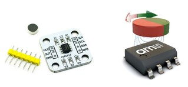
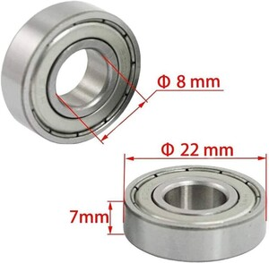
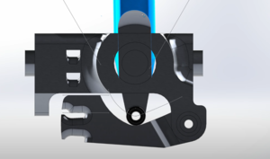
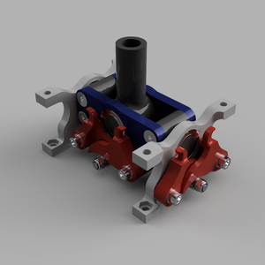
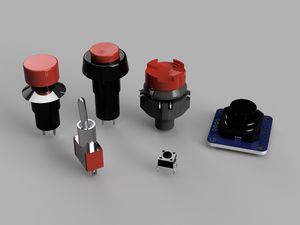
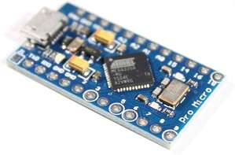

# Études et choix techniques

# Inspiration et Conception

Notre projet de simulateur de vol s'est largement inspiré des commandes de vol de véritables appareils militaires pour assurer un réalisme et une immersion maximum. Plus spécifiquement, le joystick de notre simulateur est inspiré de celui du F-16, tandis que la commande de gaz s'inspire de celle du A-10C.

# Capteurs à Effet Hall AS5600

Pour la mesure des mouvements de nos commandes, nous avons choisi d'utiliser des capteurs à effet Hall AS5600. L'effet Hall est un phénomène où un courant électrique dans un matériau génère une petite tension lorsqu'il traverse un champ magnétique, permettant de détecter ce champ et de ce fait la position angulaire d’un aiment. Ces capteurs offrent plusieurs avantages par rapport aux potentiomètres traditionnels, notamment :

•	**Absence de Frottement** : Les capteurs à effet Hall fonctionnent sans contact physique entre les composants, éliminant ainsi les frottements et l'usure mécanique, ce qui améliore la durabilité.

•	**Précision Accrue** : Les capteurs à effet Hall offrent une précision de mesure supérieure, essentielle pour des commandes de vol où la réactivité et la précision sont cruciales.

•	**Durée de Vie Allongée** : La nature sans contact de ces capteurs prolonge leur durée de vie comparée aux potentiomètres.

*Capteur à effet Hall AS5600*

# Roulements 608ZZ

Pour assurer une fluidité optimale lors de l'utilisation du joystick et de la commande de gaz, chaque axe de rotation est monté sur des roulements 608ZZ. Ces roulements sont choisis pour plusieurs raisons :

•	**Disponibilité et Coût** : Le roulement 608ZZ est très commun et facile à trouver dans le commerce à un prix raisonnable.

•	**Dimensions et Intégration** : Ses dimensions permettent une grande flexibilité d'intégration dans notre conception.

•	**Fluidité de Mouvement** : Les roulements 608ZZ offrent une résistance minimale, assurant des mouvements fluides et précis.

*Roulement 608zz*

# Système de Retour de Force

Le retour de force dans notre joystick est conçu pour simuler la résistance rencontrée dans un véritable avion de chasse. Initialement, nous avons conçu un système avec un roulement en contrainte sur une pièce montée sur ressort en dessous de la base pour contrôler les axes X et Y. Cependant, pour des raisons d'encombrement, ce système a été déplacé à l'extrémité opposée des capteurs AS5600.

*Premier système de retour de force*

# Composants Électroniques

Le choix des composants électroniques pour la poignée du joystick et la commande de gaz a été déterminé par les fonctionnalités attendues et la nécessité d'un encombrement minimal. Nous avons choisi :

•	**Joystick** : Trois boutons poussoirs, un mini joystick, un hat-switch et un interrupteur à bascule. Face à la difficulté de trouver un hat-switch à un prix abordable, nous avons décidé d'en développer un nous-mêmes.

•	**Commande de Gaz** : Six interrupteurs à bascule, deux boutons poussoirs, deux encodeurs rotatifs et un mini joystick.

*Composants électroniques utilisés dans le joystick*

# Carte Arduino Pro Micro

Pour la partie électronique programmable, nous avons opté pour une carte Arduino Pro Micro en raison de ses nombreux avantages :

•	**Facilité de Programmation** : La carte est facilement programmable avec des librairies compatibles bien documentées.

•	**Rapidité et Faible Latence** : Elle offre une exécution rapide des commandes avec une latence minimale, essentielle pour un simulateur de vol en temps réel.

•	**Accessibilité et Coût** : Les clones de la carte Arduino Pro Micro sont facilement disponibles dans le commerce à des prix très abordables.

•	**Compatibilité** : Sa compatibilité avec divers périphériques d'interfaçage répond parfaitement à nos besoins techniques.

*Arduino Pro Micro*

# Conclusion

Les choix techniques effectués pour notre simulateur de vol ont été guidés par la recherche d'une précision, d'une durabilité et d'une immersion maximales. Les capteurs à effet Hall AS5600, les roulements 608ZZ, le système de retour de force optimisé et les composants électroniques soigneusement sélectionnés contribuent tous à un simulateur réaliste et performant. Le choix de la carte Arduino Pro Micro assure une gestion efficace et rapide de l'ensemble du système, rendant notre simulateur à la fois innovant et accessible.
