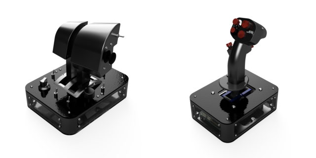

# Bienvenue sur notre site Projet Simulateur de Vol

Bienvenue dans la documentation du projet de création de commandes de simulateur de vol. Ce site a pour but de fournir toutes les informations nécessaires pour comprendre et utiliser notre projet.

## À propos du Projet

Notre projet consiste à créer de A à Z des commandes de vol utilisables sur ordinateur sur des logiciels comme microsoft flight simulator, pour cela nous avons réalisé un joystick ainsi que des commandes de gaz permettant le controle précis et intuitif de différents aéronerf.

## Poster

Ici vous publierez le poster de votre projet.

## 

<model-viewer src="images/joystick_prototype_v3 copy.glb" ar ar-modes="webxr scene-viewer quick-look" camera-controls tone-mapping="commerce" poster="images/poster copy.webp" shadow-intensity="1">
   
</model-viewer>

## Vidéo

Ici vous publierez la vidéo de votre projet. 
- Moins de 1min30
- Présentation du projet 
- Des explication du fonctionnement du projet
- Des vues du projet / Prototype / Application etc... 
- Des plans du fonctionnement (même basique ou des éléments séparés)
- Une conclusion
Si en stockage local : >50mo

<video src="images/intro_amiens.mp4" controls title="Title"  style="width: 100%;"></video>

---
