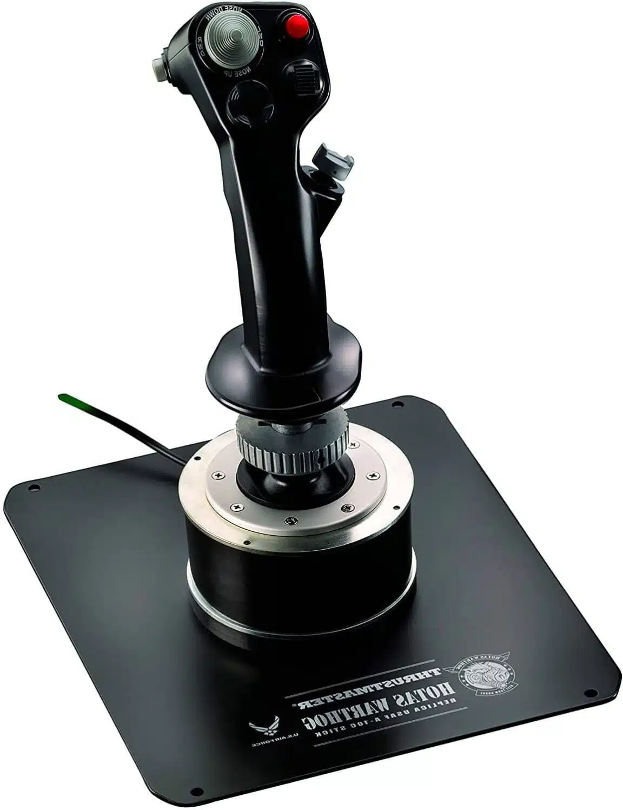

# Introduction

Lorem ipsum dolor sit amet, consectetur adipiscing elit. Sed non risus. Suspendisse lectus tortor, dignissim sit amet, adipiscing nec, ultricies sed, dolor.

## Contexte du Projet

Ce projet a été réalisé dans le cadre du projet que nous devons effectuer pendant notre 3ème année d'études au sein d'unilasalle Amiens.

## Objectifs du Projet

L'objectif du projet est de créer un simulateur.

# Cahier des Charges

1. Spécifications Techniques des accessoires de commande :

    1.a Joystick :

            Détection de mouvement avec capteurs a effets hall
            Boutons programmables
            Hat switch
            D pad
            Gachette
            Corps imprimés en 3D / base en métal

Inspirations : 

    

    
 