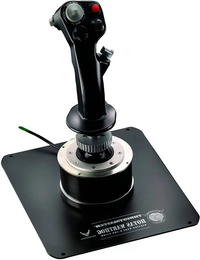

# Contexte du Projet

Dans le cadre de notre projet de 3ème année au sein de l'école d'ingénieur UniLaSalle Amiens, 75h sont dédiées à la réalisation d'un projet permettant de mettre en œuvre et approfondir différentes connaissances acquises durant les années précédentes dans des domaines techniques tels que l'électronique, la modélisation ou encore la programmation mais également de développer des compétences personnelles tels que la gestion d'équipe ou le coworking.

Certains membres de notre équipe ayant réalisé dans le cadre du projet d'Innovation Technologique et Eco-Concéption durant notre seconde année de cycle préparatoire, un volant type F1 fonctionnel dédié à l'utilisation en Sim Racing. Nous avons décidés de nous lancer une fois de plus dans la domaine de la simulation avec la réalisation d'un simulateur de vol.

Un projet similaire ayant été abandonné il y'a quelques années, le choix de ce projet a été d'autant plus motivant dans sa concrétisation tout en utilisant les nouvelles technologies qui sont aujourd'hui à notre disposition. C'est pourquoi nous nous sommes attardés sur la création d'un simulateur d'avion de chasse utilisable en Réalité Virtuelle.

# Objectifs du Projet

Concevoir, construire et mettre en œuvre un simulateur de vol d'avion de chasse réaliste et immersif utilisable en réalité virtuelle, offrant une expérience utilisateur hautement satisfaisante.

Objectifs Spécifiques :

1.Accessoires de Commande :

1.1.Concevoir et construire un joystick ainsi qu'une commande gaz offrant une précision
et une réactivité optimales, intégrés au simulateur avec une communication fiable et une
compatibilité logicielle.

2.Châssis sur Mesure :
---
layout: default
nav_order: 3
title: Objectifs du projet
---

# Contexte du Projet

Dans le cadre de notre projet de 3ème année au sein de l'école d'ingénieur UniLaSalle Amiens, 75h sont dédiées à la réalisation d'un projet permettant de mettre en œuvre et approfondir différentes connaissances acquises durant les années précédentes dans des domaines techniques tels que l'électronique, la modélisation ou encore la programmation mais également de développer des compétences personnelles tels que la gestion d'équipe ou le coworking.

Certains membres de notre équipe ayant réalisé dans le cadre du projet d'Innovation Technologique et Eco-Concéption durant notre seconde année de cycle préparatoire, un volant type F1 fonctionnel dédié à l'utilisation en Sim Racing. Nous avons décidés de nous lancer une fois de plus dans la domaine de la simulation avec la réalisation d'un simulateur de vol.

Un projet similaire ayant été abandonné il y'a quelques années, le choix de ce projet a été d'autant plus motivant dans sa concrétisation tout en utilisant les nouvelles technologies qui sont aujourd'hui à notre disposition. C'est pourquoi nous nous sommes attardés sur la création d'un simulateur d'avion de chasse utilisable en Réalité Virtuelle.

# Objectifs du Projet

Concevoir, construire et mettre en œuvre un simulateur de vol d'avion de chasse réaliste et immersif utilisable en réalité virtuelle, offrant une expérience utilisateur hautement satisfaisante.

Objectifs Spécifiques :

1.Accessoires de Commande :

1.1.Concevoir et construire un joystick ainsi qu'une commande gaz offrant une précision
et une réactivité optimales, intégrés au simulateur avec une communication fiable et une
compatibilité logicielle.

2.Châssis sur Mesure :

2.1.Concevoir un châssis robuste en profilé aluminium pour assurer la stabilité et la
durabilité du simulateur, en veillant à son assemblage solide pour supporter efficacement les
accessoires de commande.

# Cahier des Charges

## 1. Spécifications matérielles et logicielles :

### 1.1 Casque de réalité virtuelle :

*HTC Vive Focus 3*

### 1.2 Logiciels de simulations

*Microsoft Flight Simulator 2020 / Digital Combat Simulator*

## 2. Spécifications Techniques des accessoires de commande :

### 1.1 Joystick :

  - Détection de mouvements avec capteurs à effets hall 
  - Trois boutons poussoirs
  - Hat switch 
  - Mini joystick
  - Gachette
  - Interrupteur à bascule
  - Corps et base imprimés en 3D 

**Inspirations :** 

*Thrustmaster HOTAS Warthog™ Joystick*
    

### 1.2 commandes de gaz : 

  - Détection de mouvements avec capteurs à effets hall
  - Deux boutons poussoirs
  - Deux encodeurs rotatifs
  - Un mini joystick 
  - Six interrupteurs à bascule
  - Corps et base imprimés en 3D 

**Inspirations :**

*Thrustmaster HOTAS Warthog™ Dual Throttle*

2.1.Concevoir un châssis robuste en profilé aluminium pour assurer la stabilité et la
durabilité du simulateur, en veillant à son assemblage solide pour supporter efficacement les
accessoires de commande.

# Cahier des Charges

## 1. Spécifications Techniques des accessoires de commande :

### 1.1 Joystick :

  - Détection de mouvements avec capteurs à effets hall 
  - Trois boutons poussoirs
  - Hat switch 
  - Mini joystick
  - Gachette
  - Interrupteur à bascule
  - Corps et base imprimés en 3D 

**Inspirations :** 

*Thrustmaster HOTAS Warthog™ Joystick*
    

### 1.2 commandes de gaz : 

  - Détection de mouvements avec capteurs à effets hall
  - Deux boutons poussoirs
  - Deux encodeurs rotatifs
  - Un mini joystick 
  - Six interrupteurs à bascule
  - Corps et base imprimés en 3D 

**Inspirations :**

*Thrustmaster HOTAS Warthog™ Dual Throttle*
